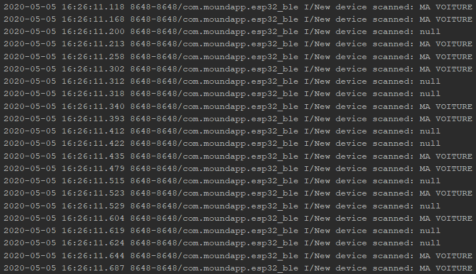

# Steps To Reproduce the App

First, I created a new basic android project

Then, I integrated BLE with these steps : 

## Integrating Bluetooth Low Energy (BLE)

I followed the official [documentation](https://developer.android.com/guide/topics/connectivity/bluetooth-le) of Android to do this.

### Adding the right permissions to the app manifest

I add the 3 following lines

```xml
<manifest xmlns:android="http://schemas.android.com/apk/res/android" package="com.moundapp.esp32_ble">
    
    <uses-permission android:name="android.permission.BLUETOOTH"/>
    <uses-permission android:name="android.permission.BLUETOOTH_ADMIN"/>
    <uses-permission android:name="android.permission.ACCESS_FINE_LOCATION" />
    <uses-permission android:name="android.permission.ACCESS_COARSE_LOCATION" />
    
</manifest>
```

### Check if the phone supports BLE

Then, I implement a function (quitteSiLapplicationNeSupportePasLeBLE)
that quit the app if the phone doesn't support BLE. I call her in the
onCreate of my MainActivity (This is the first function called when the
application is created)

```java
public class MainActivity extends AppCompatActivity {

    @Override
    protected void onCreate(Bundle savedInstanceState) {
        super.onCreate(savedInstanceState);
        setContentView(R.layout.activity_main);

        quitteSiLapplicationNeSupportePasLeBLE();
    }

    private void quitteSiLapplicationNeSupportePasLeBLE(){

        //If the phone doesn't support BLE
        if (!getPackageManager().hasSystemFeature(PackageManager.FEATURE_BLUETOOTH_LE)) {
            //Then I show a Toast that indicate the user that it doesn't support bluetooth
            Toast.makeText(this, "Le BLE n'est pas supporté sur cet appareil!", Toast.LENGTH_SHORT).show();

            //After, that, I wait 1s to call the finish function that terminate the app
            final Handler handler = new Handler();
            handler.postDelayed(new Runnable() {
                @Override
                public void run() {
                    finish();
                }
            }, 1000);
        }

    }
}
```

Check what it does if the device doesn't support the BLE with this
[video!](video/dont_support_ble.mp4)

### Adding the Bluetooth Scan functionnality

To interact with other BLE devices, you need to connect with them. But
first, you need to find them (thanks to the scan).

```java
public class MainActivity extends AppCompatActivity {

    /*The BluetoothAdapter is required for any and all Bluetooth activity.
    The BluetoothAdapter represents the device's own Bluetooth adapter (the Bluetooth radio).
    There's one Bluetooth adapter for the entire system, and your application can interact with
    it using this object*/
    private BluetoothAdapter bluetoothAdapter;

    //some stuff..

    private void initialiseLeBluetooth(){
        // Initializes Bluetooth adapter.
        final BluetoothManager bluetoothManager = (BluetoothManager) getSystemService(Context.BLUETOOTH_SERVICE);
        bluetoothAdapter = bluetoothManager.getAdapter();

        // Ensures Bluetooth is available on the device and it is enabled. If not,
        // displays a dialog requesting user permission to enable Bluetooth.
        if (bluetoothAdapter == null || !bluetoothAdapter.isEnabled()) {
            Intent enableBtIntent = new Intent(BluetoothAdapter.ACTION_REQUEST_ENABLE);
            startActivityForResult(enableBtIntent, REQUEST_ENABLE_BT);
        }

    }
}
``` 

So now, if the Bluetooth isn't activated we display a dialog (a sort of
popup) that ask the user to turn it on.

Here is what it looks like : 

<p align="center">
    
</p>

But when the dialog appears, we have two solutions : 

- The user clicks authorize and everything is OK
- The user clicks refuse and we need to handle that situation!

To handle that, we need to deal with Activity results. Indeed, when we
call `startActivityForResult(enableBtIntent, REQUEST_ENABLE_BT)` , we
start a new Activity, and to get the result of the Activity (If the user
clicked on authorize or refuse), we need to override the function
onActivityResult. Indeed, if you call startActivityForResult(...,
REQUEST_CODE), when the activity called finishes, the function
onActivityResult is called with the REQUEST_CODE as parameter and the
result of the activity. Thanks to that, we will know if the user
activates or not the bluetooth.

```java
public class MainActivity extends AppCompatActivity {

    /*The REQUEST_ENABLE_BT constant passed to startActivityForResult(android.content.Intent, int)
    is a locally-defined integer (which must be greater than 0) that the system passes back to you in your
    onActivityResult(int, int, android.content.Intent) implementation as the requestCode parameter.*/
    private static int REQUEST_ENABLE_BT = 15;

    //some stuff

    private void initialiseLeBluetooth(){
        
        //some stuff
        
        if (bluetoothAdapter == null || !bluetoothAdapter.isEnabled()) {
            Intent enableBtIntent = new Intent(BluetoothAdapter.ACTION_REQUEST_ENABLE);
            //I start a new Activity that is a dialog that ask the user to activate the bluetooth
            //When this activity finishes, the function onActivityResult will be called with the parameter REQUEST_ENABLE_BT as requestCode
            startActivityForResult(enableBtIntent, REQUEST_ENABLE_BT);
        }

    }

    @Override
    protected void onActivityResult(int requestCode, int resultCode, @Nullable Intent data) {
        super.onActivityResult(requestCode, resultCode, data);

        //If the request
        if (requestCode == REQUEST_ENABLE_BT){//if the result correspond to the dialog "Turn your bluetooth on"
            if (resultCode == RESULT_OK){
                //The user turn the bluetooth On
                //everything is ok
            }else{
                //The user hasn't turn the bluetooth on
                finish();//I finish the app if he doesn't want to turn bluetooth on
            }
        }

    }
}
```

Now I need a last thing before I can run the scan. Indeed, I need to
ckeck if I have all the permissions. So I made/override these 2
functions : askPermissionsOfUser and onRequestPermissionsResult

```java
public class MainActivity extends AppCompatActivity {

    private static final int PERMISSION_REQUEST_COARSE_LOCATION = 1;

    //some stuff
    
    private void startBluetoothScan(){
        bluetoothDevicesScanned = new ArrayList<>();//initalisation of my list
        if (askPermissionsOfUser()){
            //I can launch the scan
        }
    }

    /**
     *
     * @return true if permissions are already granted, otherwise return else
     */
    private boolean askPermissionsOfUser(){
        if (Build.VERSION.SDK_INT >= Build.VERSION_CODES.M) {
            // Android M Permission check
            if (this.checkSelfPermission(Manifest.permission.ACCESS_COARSE_LOCATION) != PackageManager.PERMISSION_GRANTED){
                final AlertDialog.Builder builder = new AlertDialog.Builder(this);
                builder.setTitle("This app needs location access fro BLE");
                builder.setMessage("Please grant location access so this app can detect devices.");
                builder.setPositiveButton(android.R.string.ok, null);
                builder.setOnDismissListener(new DialogInterface.OnDismissListener(){
                    public void onDismiss(DialogInterface dialog) {
                        requestPermissions(new String[]{Manifest.permission.ACCESS_COARSE_LOCATION}, PERMISSION_REQUEST_COARSE_LOCATION);
                    }
                });
                builder.show();
                return false;
            }
        }

        return true;

    }

    @Override
    public void onRequestPermissionsResult(int requestCode,
                                           String permissions[],
                                           int[] grantResults) {
        switch (requestCode) {
            case PERMISSION_REQUEST_COARSE_LOCATION: {
                if (grantResults[0] == PackageManager.PERMISSION_GRANTED) {
                    //everything is OK
                    //I can launch the scan
                } else {
                    finish();//Else i finish the app
                }
                return;
            }
        }
    }

    
}
```

Now I can launch the scan with these functions.

```java
public class MainActivity extends AppCompatActivity {

    private static final int PERMISSION_REQUEST_COARSE_LOCATION = 1;

    //A list that contains the list of bluetooth Devices that I found
    private ArrayList<BluetoothDevice> bluetoothDevicesScanned;
    
    private boolean mScanning = false;//variable to know if I am currently scanning or not

    //some stuff

    private void startBluetoothScan(){
        bluetoothDevicesScanned = new ArrayList<>();//initalisation of my list
        if (askPermissionsOfUser()){
            Log.i("device","start the scan");
            bluetoothAdapter.startLeScan(leScanCallback);//I start the scan
        }
    }

    private BluetoothAdapter.LeScanCallback leScanCallback =
            new BluetoothAdapter.LeScanCallback() {
                @Override
                public void onLeScan(final BluetoothDevice device, int rssi,
                                     byte[] scanRecord) {
                    runOnUiThread(new Runnable() {
                        @Override
                        public void run() {
                            //When I find a device, I add it to my bluetoothScannedList
                            bluetoothDevicesScanned.add(device);
                            Log.i("New device scanned",""+device.getName());
                        }
                    });
                }
            };

}

```

Here is the result that I got : 

<p align="center">
    
</p>

So I found the esp32 BLE Server that I called "MA VOITURE".

No I need implement the bluetooth connection to the device.

I modify the activity_main.xml to have a simple Layout that ask me the
name of the device I want to connect to and a button connect.

<p align="center">
    
</p>

Then I modify the code of my MainActivity to add interaction with my UI
elements

```java
public class MainActivity extends AppCompatActivity {
    
    //some stuff
    
    private EditText edit_text_name_target;//this is a reference to my UI editText
    private Button button_connect;//this is a reference to my UI button
    
    //some stuff
    
     private void initComponents(){
        edit_text_name_target = findViewById(R.id.edit_text_name_target);
        button_connect = findViewById(R.id.btn_connect);
        button_connect.setOnClickListener(new View.OnClickListener() {
            @Override
            public void onClick(View view) {
                //When i click on the button, this function is called

                String deviceName = edit_text_name_target.getText().toString();//I get the text of the editText
                BluetoothDevice deviceSearched = null;
                Log.i("DEVICE", "I m searching a device with name equals " + deviceName);
                for (BluetoothDevice device:bluetoothDevicesScanned) {
                    if (deviceName.equals(device.getName())){
                        deviceSearched = device;
                    }
                }

                if (deviceSearched == null){
                    Toast.makeText(view.getContext(), "Aucun appareil BLE avec ce nom trouvé", Toast.LENGTH_SHORT).show();
                }else{
                    Toast.makeText(view.getContext(), "Un appareil a été trouvé", Toast.LENGTH_SHORT).show();
                    connectToDevice(deviceSearched);//I connect to this bluetooth device
                }

            }
        });
    }

}

```


