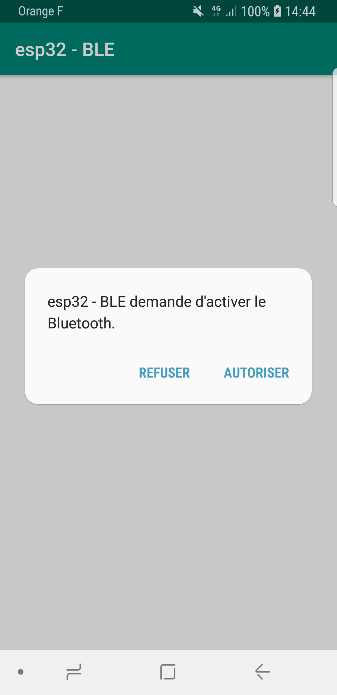

# Steps To Reproduce the App

First, I created a new basic android project

Then, I integrated BLE with these steps : 

## Integrating Bluetooth Low Energy (BLE)

I followed the official [documentation](https://developer.android.com/guide/topics/connectivity/bluetooth-le) of Android to do this.

### Adding the right permissions to the app manifest

I add the 3 following lines

```xml
<manifest xmlns:android="http://schemas.android.com/apk/res/android" package="com.moundapp.esp32_ble">
    
    <uses-permission android:name="android.permission.BLUETOOTH"/>
    <uses-permission android:name="android.permission.BLUETOOTH_ADMIN"/>
    <uses-permission android:name="android.permission.ACCESS_FINE_LOCATION"/>

</manifest>
```

### Check if the phone supports BLE

Then, I implement a function (quitteSiLapplicationNeSupportePasLeBLE)
that quit the app if the phone doesn't support BLE. I call her in the
onCreate of my MainActivity (This is the first function called when the
application is created)

```java
public class MainActivity extends AppCompatActivity {

    @Override
    protected void onCreate(Bundle savedInstanceState) {
        super.onCreate(savedInstanceState);
        setContentView(R.layout.activity_main);

        quitteSiLapplicationNeSupportePasLeBLE();
    }

    private void quitteSiLapplicationNeSupportePasLeBLE(){

        //If the phone doesn't support BLE
        if (!getPackageManager().hasSystemFeature(PackageManager.FEATURE_BLUETOOTH_LE)) {
            //Then I show a Toast that indicate the user that it doesn't support bluetooth
            Toast.makeText(this, "Le BLE n'est pas supporté sur cet appareil!", Toast.LENGTH_SHORT).show();

            //After, that, I wait 1s to call the finish function that terminate the app
            final Handler handler = new Handler();
            handler.postDelayed(new Runnable() {
                @Override
                public void run() {
                    finish();
                }
            }, 1000);
        }

    }
}
```

Check what it does if the device doesn't support the BLE with this
[video!](video/dont_support_ble.mp4)

### Adding the Bluetooth Scan functionnality

To interact with other BLE devices, you need to connect with them. But
first, you need to find them (thanks to the scan).

```java
public class MainActivity extends AppCompatActivity {

    /*The BluetoothAdapter is required for any and all Bluetooth activity.
    The BluetoothAdapter represents the device's own Bluetooth adapter (the Bluetooth radio).
    There's one Bluetooth adapter for the entire system, and your application can interact with
    it using this object*/
    private BluetoothAdapter bluetoothAdapter;

    //some stuff..

    private void initialiseLeBluetooth(){
        // Initializes Bluetooth adapter.
        final BluetoothManager bluetoothManager = (BluetoothManager) getSystemService(Context.BLUETOOTH_SERVICE);
        bluetoothAdapter = bluetoothManager.getAdapter();

        // Ensures Bluetooth is available on the device and it is enabled. If not,
        // displays a dialog requesting user permission to enable Bluetooth.
        if (bluetoothAdapter == null || !bluetoothAdapter.isEnabled()) {
            Intent enableBtIntent = new Intent(BluetoothAdapter.ACTION_REQUEST_ENABLE);
            startActivityForResult(enableBtIntent, REQUEST_ENABLE_BT);
        }

    }
}
``` 

So now, if the Bluetooth isn't activated we display a dialog (a sort of
popup) that ask the user to turn it on.

Here is what it looks like : 

